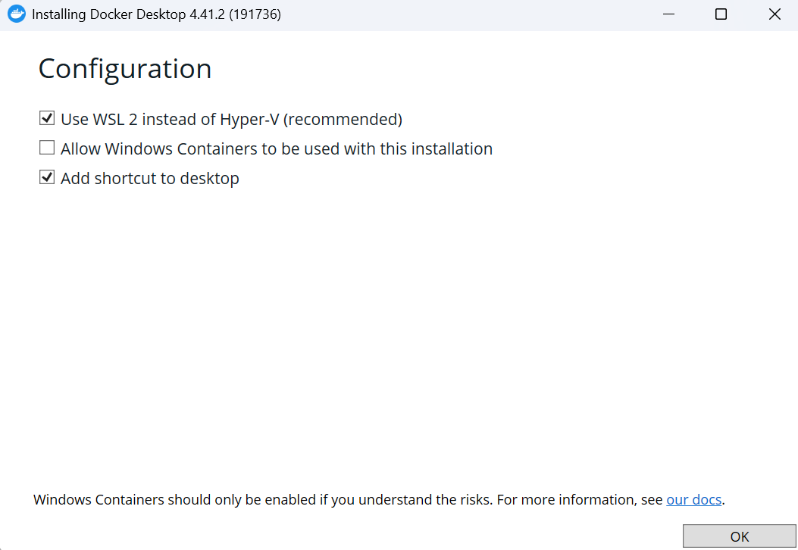
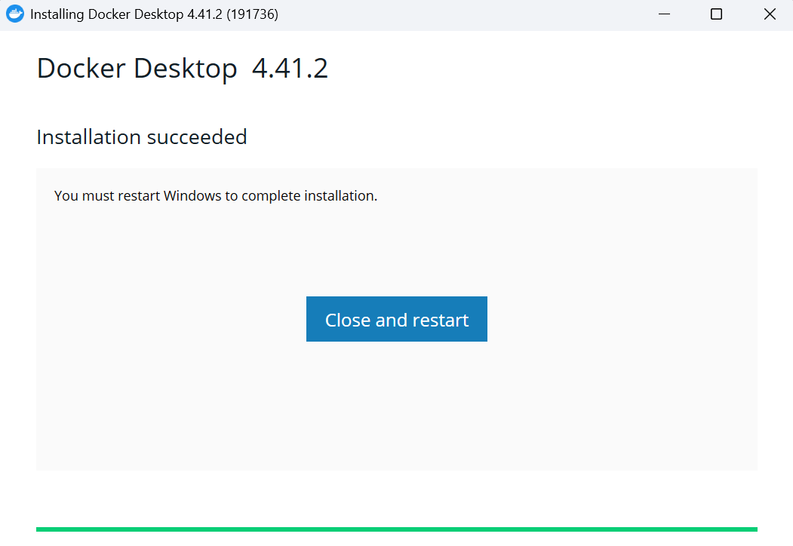
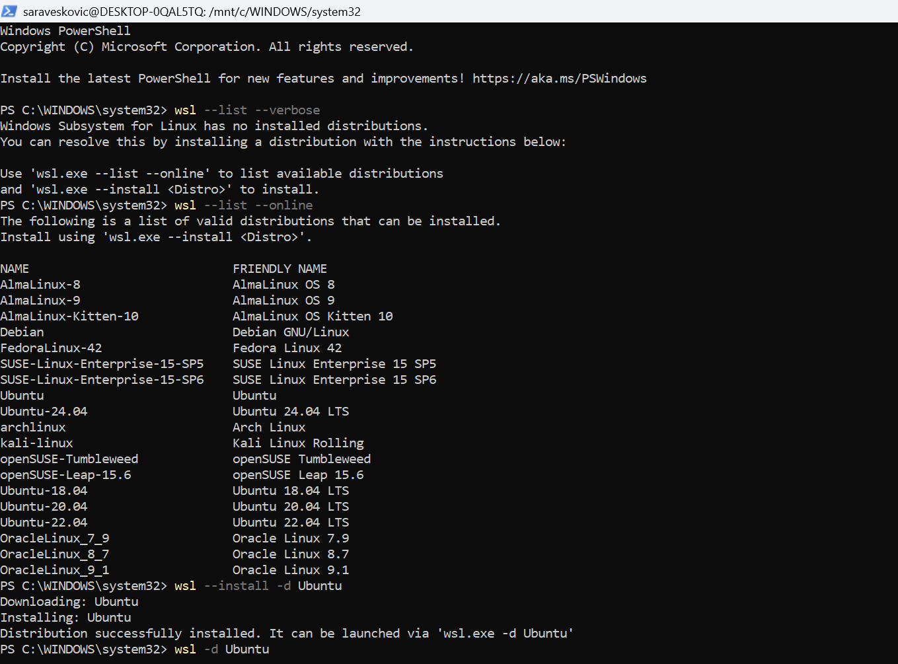
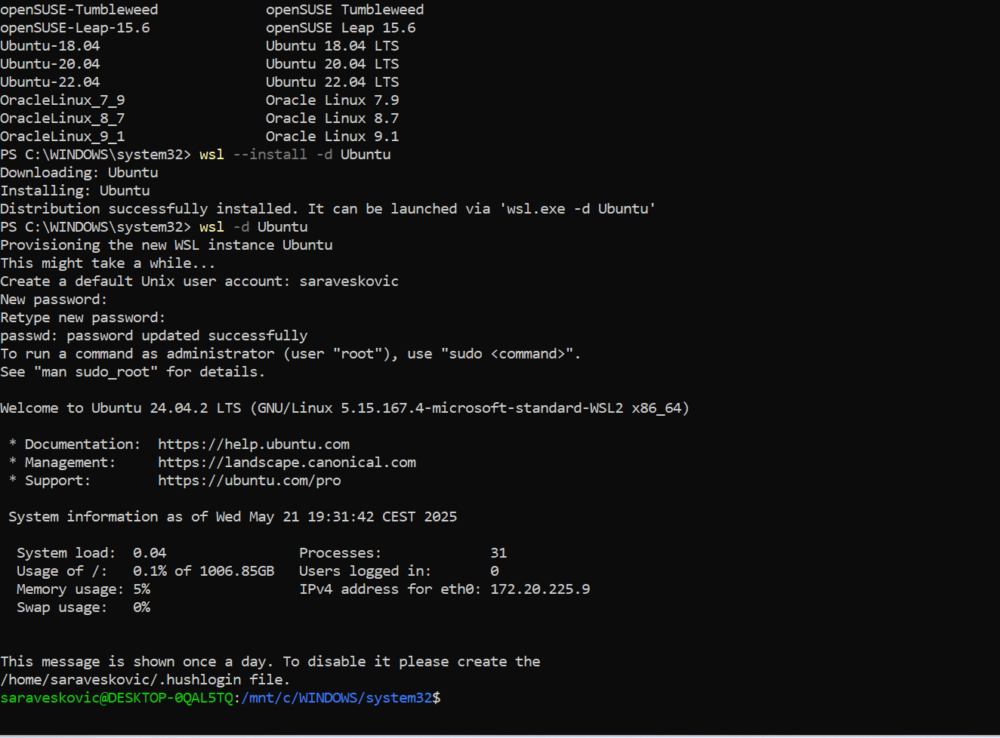
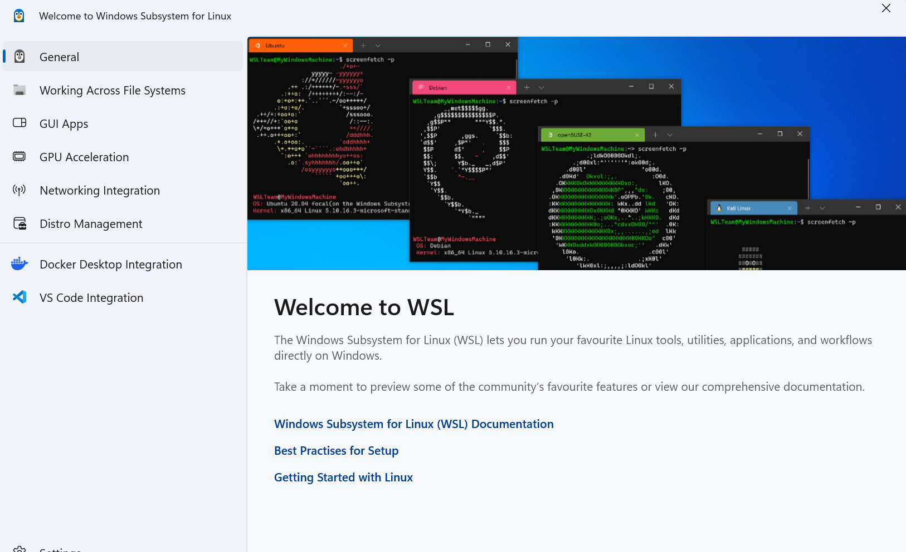
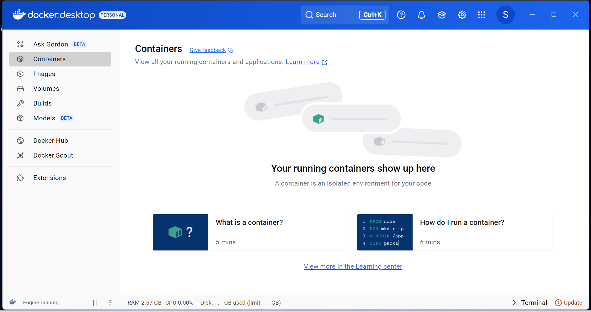
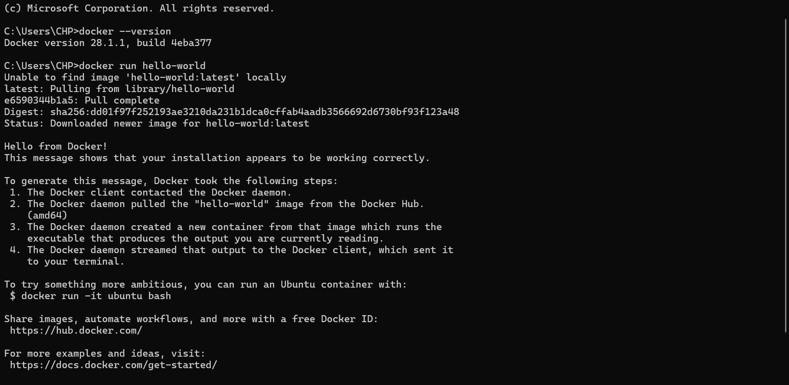

# Namestitev Dockerja na lokalni računalnik

#### Docker je platforma za paketiranje, testiranje in zagon aplikacij v kontejnerjih – izoliranih enotah, ki vsebujejo vse, kar aplikacija potrebuje za delovanje. Tako omogoča dosledno izvajanje v različnih okoljih in poenostavi razvoj, testiranje ter distribucijo. V tem delu projektne naloge bomo Docker uporabili za lokalni zagon aplikacije in podatkovne baze kot pripravo na namestitev v okolje Azure.

#### Docker Desktop za Windows sem prenesla s uradne [strani](https://docs.docker.com/get-started/get-docker/), pri čemer sem izbrala različico **Docker Desktop for Windows - x86_64**. Med namestitvijo sem označila možnost **Use WSL 2 instead of Hyper-V**, ki omogoča, da Docker uporablja Windows Subsystem for Linux 2 (WSL 2) kot zaledni sistem, kar zagotavlja boljše zmogljivosti in boljšo integracijo z Linux okoljem.




###### *Docker Desktop na sistemu Windows uporablja WSL 2 kot zaledje za zagon Linux kontejnerjev, saj Windows sam po sebi ne omogoča neposrednega zagona Linux aplikacij. WSL 2 omogoča zagon jedra Linux znotraj okolja Windows in s tem nudi Dockerju potrebno infrastrukturo. Vendar pa WSL 2 za svoje delovanje prav tako zahteva nameščeno Linux distribucijo, na primer Ubuntu.*

#### Po zaključku namestitve sem kliknila na *Close and restart*, pri čemer se je računalnik samodejno ponovno zagnal. Po ponovnem zagonu se je prikazalo okno z besedilom **Docker Subscription Service Agreement**, ki sem ga sprejela s klikom na *Accept*.


#### Nato se je odprlo pogovorno okno za zaključek namestitve, kjer sem izbrala možnost **Use recommended settings** in kliknila *Finish*.

#### Docker je nato prikazal okno, v katerem sem lahko izbrala namen uporabe, a sem ta korak preskočila. Nato sem se prijavila v **Docker Desktop** s svojim *GitHub* računom, kar omogoča dostop do Docker Hub-a in upravljanje kontejnerjev.


#### Po ponovnem zagonu Docker Desktop aplikacije prek menija Start sem imela težave, saj se aplikacija ni želela takoj zagnati. Da bi ugotovila razlog, sem odprla *PowerShell* kot administrator:



#### Najprej sem želela preveriti nameščene WSL distribucije in njihove različice. Prejela sem sporočilo, da je WSL nameščen, vendar ni nameščene nobene Linux distribucije. To sem ugotovila z naslednjim ukazom:
```
wsl --list --verbose
```
#### Zato sem za rešitev težave preverila razpoložljive distribucije za namestitev z ukazom:
```
wsl --list --online
```
#### Nato sem namestila Ubuntu distribucijo z naslednjim ukazom:
```
wsl --install -d Ubuntu
```
#### Po tem ukazu se je prikazalo okno, ki je del samodejnega zagona distribucije:


#### Nato sem v terminalu z ukazom:
```
wsl -d Ubuntu
```
#### ustvarila novega uporabnika znotraj Linux okolja in nastavila geslo. S tem sem uspešno ustvarila skrbniški račun znotraj Ubuntu sistema.

#### Po vsem tem sem končno lahko odprla Docker iz menija Start:


#### Preverila sem tudi različico Dockerja z ukazom:
```
docker --version
```
#### in izvedla testni primer, da se prepričam, da vse deluje pravilno:
```
docker run hello-world
```
#### Sporočilo, da je kontejner uspešno zagnan, je potrdilo pravilno delovanje Dockerja:


