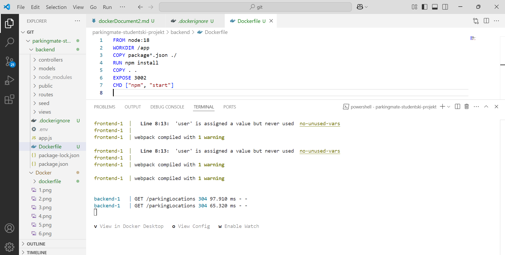

# P2 - 2. Projektna naloga_Azure

##### V okviru prve projektne naloge pri predmetu **Sistemska administracija** je bil cilj razviti backend spletne aplikacije, ki uporablja podatkovno bazo, ter jo postaviti v Docker okolje znotraj virtualnega stroja na Azure platformi. Preden smo izvedli deploy v oblak, smo aplikacijo najprej testirali in zagnali lokalno v Docker okolju, da bi se prepričali, da vse komponente delujejo pravilno.

## SPLETNA APLIKACIJA I BAZA PODATAKA

#####  Naša spletna aplikacija je trenutno v začetni fazi razvoja in za zdaj vključuje zgolj backend logiko. Za preverjanje delovanja API-ja in povezave z bazo smo dodali osnovni frontend del za testne namene. Na ta način smo omogočili osnovno interakcijo s sistemom in osnovno vizualizacijo podatkov.
##### Aplikacija je tematsko zasnovana na upravljanju parkirišč v Ljubljani. Namenjena je predvsem voznikom, z namenom olajšanja iskanja in uporabe parkirnih mest ter upravljanja z njimi. Uporabniki komunicirajo s sistemom prek REST API-ja, backend del pa omogoča obdelavo podatkov o lokacijah, tipu parkirnih mest, razpoložljivosti in drugih pomembnih informacijah.
##### Za shranjevanje podatkov smo uporabili podatkovno bazo **MongoDB**, ki je gostovana zunanje prek storitve **MongoDB Atlas**. S tem smo izpolnili zahtevo, da baza ne more biti lokalna.


## NAMESTITEV DOKERJA NA LOKALNI RAČUNALNIK

#### Docker je platforma za paketiranje, testiranje in zagon aplikacij v kontejnerjih – izoliranih enotah, ki vsebujejo vse, kar aplikacija potrebuje za delovanje. Tako omogoča dosledno izvajanje v različnih okoljih in poenostavi razvoj, testiranje ter distribucijo. V tem delu projektne naloge bomo Docker uporabili za lokalni zagon aplikacije in podatkovne baze kot pripravo na namestitev v okolje Azure.

#### Docker Desktop za Windows sem prenesla s uradne [strani](https://docs.docker.com/get-started/get-docker/), pri čemer sem izbrala različico **Docker Desktop for Windows - x86_64**. Med namestitvijo sem označila možnost **Use WSL 2 instead of Hyper-V**, ki omogoča, da Docker uporablja Windows Subsystem for Linux 2 (WSL 2) kot zaledni sistem, kar zagotavlja boljše zmogljivosti in boljšo integracijo z Linux okoljem.


###### *Docker Desktop na sistemu Windows uporablja WSL 2 kot zaledje za zagon Linux kontejnerjev, saj Windows sam po sebi ne omogoča neposrednega zagona Linux aplikacij. WSL 2 omogoča zagon jedra Linux znotraj okolja Windows in s tem nudi Dockerju potrebno infrastrukturo. Vendar pa WSL 2 za svoje delovanje prav tako zahteva nameščeno Linux distribucijo, na primer Ubuntu.*

#### Po zaključku namestitve sem kliknila na *Close and restart*, pri čemer se je računalnik samodejno ponovno zagnal. Po ponovnem zagonu se je prikazalo okno z besedilom **Docker Subscription Service Agreement**, ki sem ga sprejela s klikom na *Accept*.


#### Nato se je odprlo pogovorno okno za zaključek namestitve, kjer sem izbrala možnost **Use recommended settings** in kliknila *Finish*.

#### Docker je nato prikazal okno, v katerem sem lahko izbrala namen uporabe, a sem ta korak preskočila. Nato sem se prijavila v **Docker Desktop** s svojim *GitHub* računom, kar omogoča dostop do Docker Hub-a in upravljanje kontejnerjev.


#### Po ponovnem zagonu Docker Desktop aplikacije prek menija Start sem imela težave, saj se aplikacija ni želela takoj zagnati. Da bi ugotovila razlog, sem odprla *PowerShell* kot administrator:


#### Najprej sem želela preveriti nameščene WSL distribucije in njihove različice. Prejela sem sporočilo, da je WSL nameščen, vendar ni nameščene nobene Linux distribucije. To sem ugotovila z naslednjim ukazom:
```
wsl --list --verbose
```
#### Zato sem za rešitev težave preverila razpoložljive distribucije za namestitev z ukazom:
```
wsl --list --online
```
#### Nato sem namestila Ubuntu distribucijo z naslednjim ukazom:
```
wsl --install -d Ubuntu
```
#### Po tem ukazu se je prikazalo okno, ki je del samodejnega zagona distribucije:


#### Nato sem v terminalu z ukazom:
```
wsl -d Ubuntu
```
#### ustvarila novega uporabnika znotraj Linux okolja in nastavila geslo. S tem sem uspešno ustvarila skrbniški račun znotraj Ubuntu sistema.

#### Po vsem tem sem končno lahko odprla Docker iz menija Start:


#### Preverila sem tudi različico Dockerja z ukazom:
```
docker --version
```
#### in izvedla testni primer, da se prepričam, da vse deluje pravilno:
```
docker run hello-world
```
#### Sporočilo, da je kontejner uspešno zagnan, je potrdilo pravilno delovanje Dockerja:


## DOCKERFILE

##### Za uspešno lokalno postavitev aplikacije v Docker okolju smo pripravili več ključnih konfiguracijskih datotek, kot so *Dockerfile*, *.env*, *.dockerignore* in *docker-compose.yml*.

#### **Dockerfile**

##### ***Dockerfile*** je tekstovna datoteka, ki določa, kako se aplikacija zgradi in zažene v Docker kontejnerju. Določa osnovno okolje, nastavi delovno mapo, kopira datoteke, namesti odvisnosti, definira port in ukaz za zagon aplikacije. Z njim pridobimo dosledno in prenosljivo okolje, ki deluje enako na vseh računalnikih brez dodatnih nastavitev ali namestitev, saj je celotno okolje vnaprej definirano in se samodejno ustvari ob izgradnji kontejnerja.

##### *V projektu imamo dva Dockerfile-a: enega za backend in enega za frontend, saj imata oba dela svoje okolje in odvisnosti.*

#### **Dockerfile za backend**:

#### **Dockerfile za frontend**:


##### *V Dockerfile-ih uporabljamo uradno Node.js različico 18 kot osnovno sliko. Nastavimo delovni direktorij, kamor kopiramo potrebne datoteke, nato namestimo pakete, potrebne za delovanje aplikacije. Nato kopiramo celotno kodo v kontejner. Odprt je port (EXPOSE 3002 za backend in EXPOSE 3000 za frontend), da Docker ve, na katerem portu teče aplikacija. Na koncu aplikacijo zaženemo z ukazom (CMD ["npm", "start"]).*

#### **env**

##### ***.env*** datoteke vsebujejo okoljske spremenljivke, ki jih aplikacija uporablja med delovanjem. V nasem primeru:
##### *1. Backend .env datoteka vsebuje podatke za povezavo z bazo, JWT ključ za avtentikacijo ter port, na katerem backend deluje.*

##### *2.  Frontend .env določa naslov backend strežnika, kamor pošilja zahteve, in port, na katerem frontend sprejema povezave.*

#### **dockerignore**
##### ***.dockerignore*** datoteka določa, katere datoteke ali mape naj Docker ignorira med izgradnjo slike, kar zmanjša velikost slike in pospeši proces gradnje. V našem primeru so to:


#### **docker-compose.yml**

##### Da bi hkrati zgradili in zagnali backend in frontend aplikacijo na osnovi naših Dockerfile-ov, uporabljamo ***Docker Compose***, orodje, ki omogoča upravljanje več povezanih storitev iz ene konfiguracijske datoteke — ***docker-compose.yml***.


##### *V našem primeru datoteka uporablja različico 3.8 Compose formata.*
##### *1. Backend storitev se gradi iz mape ./backend, uporablja port 3002 in bere konfiguracijo iz .env datoteke v tej mapi.* 
##### *2. Frontend storitev se gradi iz mape ./frontend, uporablja port 3000 in prav tako bere svoj .env. Dodali smo še okoljsko spremenljivko CHOKIDAR_USEPOLLING=true, ki omogoča sledenje spremembam datotek znotraj kontejnerja.*

##### *Obe storitvi imata politiko ponovnega zagona "unless-stopped", kar pomeni, da se ob izpadu samodejno ponovno zaženeta, razen če ju uporabnik ročno ustavi. Frontend storitev ima omogočeno tudi interaktivno delovanje (stdin_open in tty).*

####  **Za izgradnjo in zagon celotne aplikacije uporabimo ukaz:**
```
docker-compose up --build
```
##### pred ukazom:

##### po ukazu:


##### Po zagonu lahko v brskalniku odpremo naslov http://localhost:3000, kjer se prikaže naša spletna stran:


##### Ker uporabljamo Docker Compose, se logi iz frontend in backend kontejnerjev prikazujejo v terminalu. Ti vključujejo HTTP zahteve, opozorila in druge informacije.

#### **Nekaj uporabnih Docker ukazov:**
##### 1. Ukazi za zagon kontejnerjev (ko so že enkrat zgrajeni):
```
docker-compose up # zagon brez ponovne gradnje
docker-compose up -d  # zagon v ozadju
```
##### 2. Ukaz za ustavitev kontejnerjev:
```
docker-compose down
```

##### 3. Ostali ukazi:
```
docker-compose restart # ponovni zagon vseh storitev
docker-compose logs  # prikaz logov
docker ps  # prikaz aktivnih kontejnerjev in portov
```


## Ustvarjanje Azure navidezne naprave

Za dostop do Azure storitev brezplačno sem sledil naslednjim korakom:
1. Najprej sem obiskal stran: [https://azure.microsoft.com/en-us/free/students/](https://azure.microsoft.com/en-us/free/students/)
2. Po kliku na gumb *Start free* se je odprla stran za vnos študentskega računa.
3. Potrdil sem svojo identiteto in dokončal registracijo.
4. Po uspešni prijavi sem prejel 100 $ kredita in dostop do različnih Azure storitev (vključno z Virtual Machines).

## Ustvarjanje Azure navidezne naprave

1. Sedaj, ko sem ustvaril račun, sem obiskal povezavo:  
[https://portal.azure.com/#view/Microsoft_Azure_Billing/FreeServicesBlade](https://portal.azure.com/#view/Microsoft_Azure_Billing/FreeServicesBlade) ter na plošči **Linux Virtual Machine** kliknil gumb *Create* 


2. Ob kliku na gumb *Create* iz koraka 1, se naj odpre naslednja stran, kjer sem izbral lastnosti navidezne naprave:  


    Tukaj lahko vidimo:
    - tip naročnine (**Subscription**)
    - ime vira (**Resource group**)
    - ime navidezne naprave (**Virtual machine name**),
    - regijo (**Region**) 
    - operacijski sistem virtualne mašine (**Image**)

    Ime naprave je usklajeno z imenom projekta pri Projektnem praktikumu.  
    Operacijski sistem naprave je **Linux**, distribucije **Ubuntu Server 22.04 LTS – x64 Gen2**. Izbrali smo **Ubuntu Server 22.04 LTS – x64 Gen2**, saj gre za stabilno in pogosto uporabljano distribucijo Linuxa, ki je primerna za uporabo v produkcijskem okolju in dobro podprta z orodji, kot je Docker. Različica LTS (Long Term Support) zagotavlja dolgotrajno podporo in varnostne posodobitve.

    Gremo naprej s nastavitami:  
    
    Tukaj lahko vidimo:
    - Velikost naprave (**Size**) – *Standard_B1s - 1 vCPU, 1GiB memory*,
    - Način autentikacije administratorja (**Authentication type**) - (*Username in Password*)
    - **Inbound port rules** - (*Allow selected ports*)
    - **Inbound port** - *SSH(22)*

    ### Zakaj uporabljamo SSH?
    SSH (Secure Shell) je varen protokol za oddaljeni dostop do strežnika. Omogoča nam, da se povežemo z našo navidezno napravo preko ukazne vrstice in jo upravljamo, kot da bi bili fizično pred njo.
    Uporaba SSH je pomembna, ker:
    - zagotavlja varno komunikacijo preko omrežja,
    - omogoča enostavno upravljanje naprave brez potrebe po grafičnem vmesniku,
    - omogoča prenos datotek in izvajanje ukazov na daljavo.

    ### Prijava na navidezno napravo preko SSH

    Ko imamo omogočen **SSH port (22)** in nastavljene ustrezne pravice, se lahko na napravo prijavimo z ukazom:

    ```bash
    ssh uporabnik@ip-naslov-vm
    ```

    3. Ko sem vse to izbral bom stistnil gumb *Review + Create*, in se potem bo odprlo naslednje okno
       
    
        Tukaj vidimo osnovne informacije o naši napravi
        - Naročnino (**Subscription**)
        - Skupina virov (**Resource group**)
        - Ime navidezne naprave (**Virtual machine name**)
        - Območje (**Region**)
        - Operacijski sistem (**Image**)
        - Velikost (**Size**)
        - Tip autentikacije (**Authentication type**)
        - Uporabniško ime ob ustvarjanju navidezne naprave (**Username**)
        - Public inbound port (**Public inbound port**)
    
    4. Ob pritisku na gumb *Create* na sliki v koraku 3, bo se naša navidezna naprava ustvarila, kaj je potrjeno z sporočilom
    
    